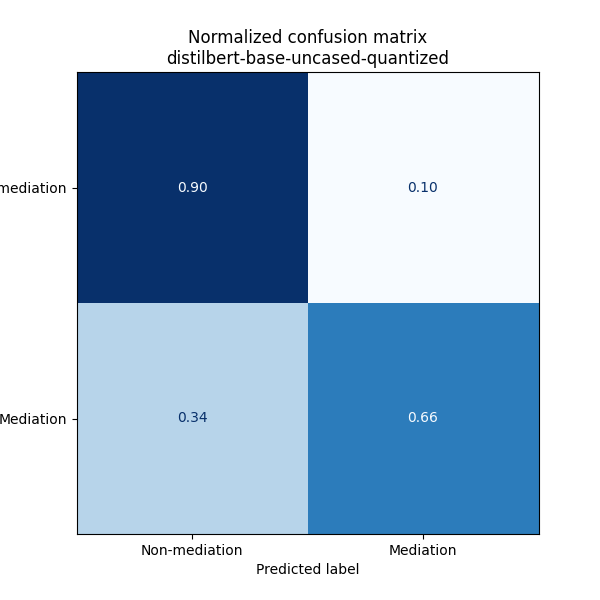
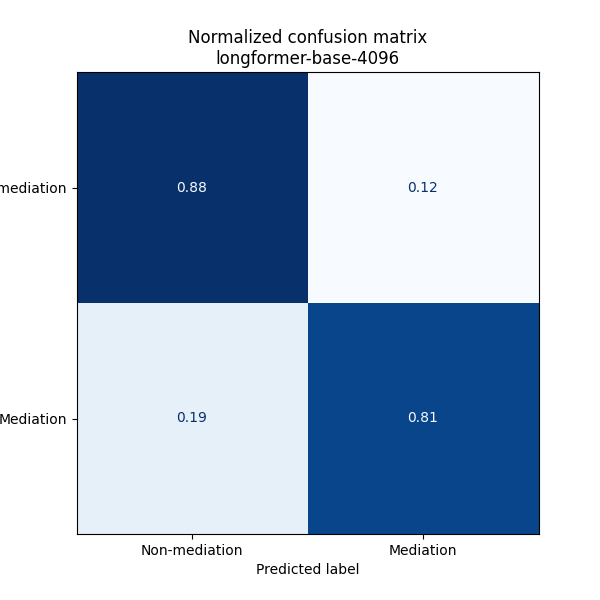

# PCWI Mediation Curation Pipeline

This repo contains the code to replicate the transformer-based prediction pipeline used for identifying government-separatist group mediation events in newspaper articles.

## Hardware Requirements

The pretrained model checkpoints are available for download from the Box account if you only want to replicate the results or reuse them. If, however, you need to fine-tune the models, then it is highly recommended you have access to a [Cuda-enabled GPU](https://developer.nvidia.com/cuda-gpus) preferably with more than 11 GB pf RAM (the more the better, but anything less than this will seriously constrain batch size and slow down training). In addition to a cuda-enabled GPU, cuda toolkit is required to performing training on the GPU. An installation guide can be found [here](https://docs.nvidia.com/cuda/index.html). The venv as specified in `requirements.txt` is written to work with cuda toolkit verison 10.2. More recent versions may not work correctly with the virtual environment. Training can be performed on a CPU in theory, but in practice this will be prohibitively slow on any dataset of meaningful size.

## Software Requirements

### External services

The code relies on two external services:

- UMD's Box cloud storage service
- Nexis Uni's [Data-as-a-Service API](https://www.lexisnexis.com/en-us/professional/data-as-a-service/CORE/API-data-delivery.page)

Interactive access to the UMD Box account requires generating a developer token for the umd-pcwi-mediation project. This can be done from the [Box Developer Console](https://umd.app.box.com/developers/console) by navigating to the `umd-pcwi-mediation` project > `Configuration` > clicking `Generate Developer Token`. This will generate an access token and client secret which can be stored in a `pipeline.conf` file in the root directory (see `example-pipeline.conf`) for an example. The developer token is only valid for 60 minutes after creation. Alternatively, for a more stable connection method using client credentials grant, store your
user ID (found under `General Settings`) in the `pipeline.conf` and use the Box SDK's [`CGAuth` Class](2PF6uPBklvuyx1ucg8VDemJRO4RoeWUj).

Documentation for Box's Python SDK can be found [here](https://github.com/box/box-python-sdk).

Access to the NU API requires an [API key](https://www.lexisnexis.com/en-us/professional/data-as-a-service/daas.page). In particular, the code requires access to their Batch News collection. The key used in the original nightly data pull is now out-of-service. Replicating the original data pull would require renewing the API key or purchasing access to a new one. Moreover, the original data pull represents a snapshot in time and, as such, is not deterministic. Future data pulls from the same data collection would not produce an exact replica.

### Python Modules

Before proceeding, users should create a python virtual environment (venv) for all module dependencies. The exact procedure for doing so varies by operating system. Instructions can be found [here](https://docs.python.org/3/library/venv.html). On Unix OSes, the following command works:

```console
$ python3 -m venv venv
```

After creating a virtual environment, run the following (on UNIX systems) in the base directory to install all required dependencies:

```console
$ source venv/bin/activate
(venv) $ pip install -r requirements.txt
```

## Project Structure

Below is the project directory tree. The `data`, `logs`, and `models` directories are largely empty but will be populated as you run the scripts.

The `notebooks` directory contains jupyter notebooks used for experimenting, debugging, developing and benchmarking the pipeline and classification models. These need not be used unless you want to gain more insight into the development process. Otherwise, all the code for reproducing the pipeline can be found in `scripts`.

```bash
├── data
├── figs
├── logs
├── models
├── notebooks
│   ├── benchmark_pipelines.ipynb
│   ├── create_human_validation_output.ipynb
│   ├── create_training_dataset.ipynb
│   ├── data_transform.ipynb
│   ├── debug.ipynb
│   ├── examine-failed-pipelines.ipynb
│   ├── experiment-with-transform.ipynb
│   ├── refetch_completes.ipynb
│   ├── reorder_searches.ipynb
│   └── train_classifiers.ipynb
├── scripts
│   ├── nu-api-batch-fetch.sh
│   ├── nu-api-data-fetch-aws-glue.py
│   ├── nu-api-data-predict-transform.py
│   ├── nu-api-data-predict.py
│   ├── nu-api-data-transform.py
│   ├── train_classifiers.py
│   └── update_mediation_seed_dataset.py
├── README.md
├── example-pipeline.conf
└── requirements.txt
```

## Retraining Models

If you intend to retrain the models from scratch, modify the training code, or fine-tune them on additional data, please read this section carefully. Otherwise, you may skip to the [Data Pipeline](##Data-Pipeline) section.

Once you have installed and activated the virtual environment, all you need to do is run the `train_classifiers.py` script. For example, to run the script as a background process on linux and log the output to a log file:

```bash
(venv) $ nohup python3 -u scripts/train_classifiers.py > logs/trains_classifiers.log &
```

## Data Pipeline

All the scripts used in the curation pipeline can be found in `scripts`. Currently, they are manually stitched together, though they certainly could be better productionized by using a pipeline orchestration tool like Apache Airflow.

For now, the sequencing is as follows:

1. Use the `nu-api-batch-fetch.sh` shell scripts to set up a nightly cron job.
2. Run `nu-api-data-transform.py` (intermittently or in one batch once the data is collected) to transform it into a format compatible with the prediction models
3. Run `nu-api-data-predict.py` to generate predictions
4. Run `nu-api-data-predict-transform.py` to convert the predictions into the final outputs for coders

### Setting up the cron job

The NU api endpoint is rate limited to 1000 requests in a single 24 hour period. Therefore, large data collections can take a long time to gather. The easiest way to automate this process is by setting up a cron job (a task your computer will run on a regular, scheduled basis). On linux, setting up cron jobs is easy. A nice guide can be found [here](https://phoenixnap.com/kb/set-up-cron-job-linux).

Cron jobs can be very finicky and not work well unless you use absolute (as opposed to relative paths) for specifying the location of files and directories. To ensure the job runs properly, first edit the `nu-api-batch-fetch.sh` file with the proper path to the current project directory (see the comments in the file for more details). Second, make sure when you add the job to the crontab file, you use absolute paths to the script and output (log file) location. Below is an example entry in the crontab file. You would replace [full-path-to-project-directory] with the full path to wherever you cloned this repo.

```bash
30 4    * * *   evan    /bin/bash [full-path-to-project-directory]/scripts/nu-api-batch-fetch.sh > [full-path-to-project-directory]/logs/fetch-dispute-data.log 2>&1
```

The above job will run the collection script every day at 4:30 AM. The job will finish when it hits the rate limit for a 24h period. Information about the job is logged to `logs/fetch-dispute-daata.log`. Data files are written to the `data/nu-api-data-raw` directory.

Note that the `nu-api-batch-fetch.sh` shell script just acts as a wrapper around the `nu-api-data-fetch-aws-glue.py` script so that the latter can be run as a cron job. All of the actual logic for fetching the data is in the latter file.

### Transforming raw data

The raw data from the Nexis Uni API will be stored in the `data/nu-api-data-raw/` directory. Before the model can predict mediation events on this data, it must be transformed. The script for transforming the data can be run as follows:

```bash
(venv) $ nohup python3 -u scripts/nu-api-data-transform.py > logs/fetch-dispute-data-transform.log &
```

This will automatically look at output directory for the transformations (`dispute-dataframes`), compare file names against the untransformed data sets in `nu-api-data-raw`, and only transform data that has not yet been transformed.

These transformations can be done intermittently or in a large batch after all data collection is complete. To productionize, one could wrap the script in a shell script using the data collection example and create a daily cron job to further automate the process.

### Predicting mediation events

The mediataion prediction script reads in data from the `data/dispute-dataframes` directory and outputs predictions to the `data/dispute-predictions` directory. It uses the same logic as the transformation script to identify which datasets have not yet been processed. It will only load and pass these to the model. If you want to re-run predictions for a certain dataset, you should delete the corresponding dataset from the `data/dispute-predictions` folder. The script can be run as follows:

```bash
(venv) $ nohup python3 -u scripts/nu-api-data-predict.py > logs/dispute-data-predict.log &
```

Note: The prediction pipeline consists of uses a longformer-based transformer model to embed the text and then passing the embeddings matrix to a logistic regression classifier head to generate the predictions. The transformer model requires access to GPU compute unless you want to wait prohibitively long for the script to finish. See [Hardware Requirements](##-Hardware-Requirements) for details on GPU computing requirements and setup.

### Transforming predictions for coders

The output of the prediction models is in JSON format and fine for forther computational purposes. If, however, you need the data converted to an excel format for further human investigation. Run the following script:

```bash
(venv) $ nohup python3 scripts/nu-api-data-predict-transform.py > logs/dispute-data-predict-transform.log &
```

## Model Development

### Prediction Task

The primary aim of the curation pipeline is to ingest a very large corpus of news articles and successfully predict news articles that include a mediation event between a non-state actor that's seeking concessions and a government. Such events are extremely rare by nature. Hence, the pipeline equates to a filtering task in a much longer coding process. Articles deemed mediation events are then handed off to a human coder for final verification. Given the extreme imbalance in classes (mediation vs non-mediation events), we expected classification performance metrics to be quite poor as a baseline.

### Classifier Architectures Tested

To build the predictor, we leverage the huggingface transformers library to tap into state of the art deep learning models for Natural Language Processing (NLP). The original model development and testing plan entailed training and comparing eight distinct embedding + classifier. We leveraged two different transformer architectures, [DistilBERT](https://arxiv.org/pdf/1910.01108) and [Longformer](https://arxiv.org/pdf/2004.05150.pdf).

DistilBERT is a small, fast, cheap and light Transformer model trained by distilling BERT base. It has 40% less parameters than bert-base-uncased, runs 60% faster while preserving over 95% of BERT’s performances as measured on the GLUE language understanding benchmark.

DistilBERT is a very popular model in production settings for its ability to balance fast runtimes with great performance. However, it has a max token size of 512, meaning any documents longer than 512 characters will be truncated. One option to handle longer documents is to convert them into a smaller chunks, generate predictions on each chunk, then use some sort of rule-based logic (e.g. majority vote) to convert the array of predictions to a single prediction. We did not do that here given time and processing constraints.

Longformer, by comparison, is designed for longer documents (hence the name) and handles up to 4096 tokens.
We can try to work around imbalance by using upsampling on the feature space. It has attention mechanism that scales linearly with sequence length, making it easy to process documents of thousands of tokens or longer. Longformer’s attention mechanism is a drop-in replacement for the standard self-attention and combines a local windowed attention with a task motivated global attention.

Each of these two models can be used to create an embedding (numerical representation) for the news articles which can then be passed to a classifier "head" (any model that can take in a _p_-dimensional vector of features and predict an output _y_). We considered testing three different classifier heads: Logistic Regression, Support Vector Machines (SVM), and a gradient booster (XG Boost). In practice, the SVM and XG Boost took significantly longer to run than the Logistic Regression head and did not provide any significant boost in performance when testing on the first DistilBERT outputs. In the case of the SVM, performance was worse. Therefore, we did not test these for the remaining transformer models.

All models are limited by their training data. Extreme imbalance in the positive class is one such limitation that pooses a serious threat to model performance. In our training data (~100k hand-labeled articles from 2 different "disputes"), positive class prevalence was a mere 0.63 percent. To try to allieviate some of this imbalance, we used a an over-sampling technique known as [sythentic minority over-sampling technique (SMOTE)](https://arxiv.org/pdf/1106.1813.pdf) available in the `imblearn` python model. This method resamples the training data and creates additional synthetic examples based on the positive class to provide a more balanced sample. We passed in the embeddings to SMOTE before training the classifier on the resampled embeddings. We acknowledge there are better ways to upsample rare datas from text data, but cost-reward trade off for developing a bespoke solution to our problem did not justify doing so.

This resulted in training and testing the following architectures for comparision:

- DistilBERT Embeddings > Logistic Regression Head
- Quantized DistilBERT Embeddings > Logistic Regression Head
- Longformer Embeddings > Logistic Regression Head

Quantization is a technique used in production that involves using lower precision floating point for the tensors for the model weights plus a few other tricks that can significantly scale down the model size and run time (allowing them to generate predictions on CPUs) while preserving performance. We tried doing this for the DistilBERT model since it was very low cost---there is a pretrained model available from Huggingface---to train.

### Results

We trained each model and compared their results. Below you can find the confusion matrices from each architecture. The left hand side of each figure is cut-off, but the y-axis labels should read "Non-mediation" and "Mediation" from top-to-bottom.

In particular, we care about the true positive versus false positive rates since, by virtue of the extreme class imbalance, predicting non-mediation events is extremely easy. You could predict every articles as non-mediation and achieve an accuracy of 99.4%. Moreover, we are primarily interested in finding _all_ mediation events and do not care about non-mediation events at all. It's more important to improperly classify an article as a mediation event than to accidentally classify a true mediation event as a non-mediation event. Hence, the False Negative and True Positive rates are what we care about minimizing and maximizing, respectively.





In the figures above, the false negative rate can be found in the bottom left cell and the true positive rate in the bottom right cell. As you can see and might expect, the two DistilBERT architectures performed similarly. The tangible difference is in runtimes, which might matter if you're constrained to CPU-only infrastructure. Out of all true mediation events, they (in)correctly labeled about (33) 67% of test data points. The longformer architecture performed signifantly better, (in)correctly labeling (19) 81% of test data points.

Since we ended up not being compute restrained, we opted to use the longformer architecture in production.
